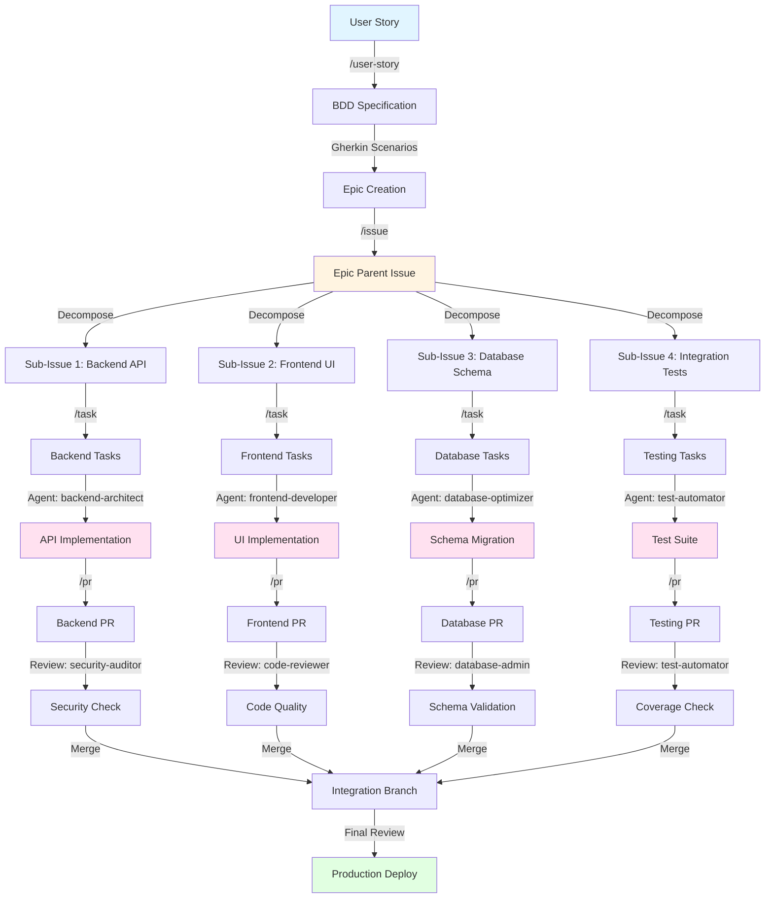

# Claude Code Configuration

Personal Claude Code configuration directory featuring 83+ specialized AI agents, custom skills, slash commands, GitHub workflow automation, and multi-agent orchestration patterns.

## Table of Contents

- [Overview](#overview)
- [Features](#features)
  - [Specialized AI Agents](#-specialized-ai-agents)
  - [Custom Skills](#-custom-skills)
  - [Slash Commands](#-slash-commands)
  - [Multi-Agent Orchestration](#-multi-agent-orchestration-patterns)
  - [Common Workflow Patterns](#-common-workflow-patterns)
- [Directory Structure](#directory-structure)
- [Quick Start](#quick-start)
  - [Installation](#installation)
  - [Basic Usage](#basic-usage)
- [Command Examples](#command-examples)
  - [GitHub Workflows](#github-workflow-commands)
  - [Research & Content](#research--content-commands)
- [Skills Guide](#skills-guide)
  - [Claude Code Customization](#claude-code-customization-skills)
  - [Domain Expertise](#domain-expertise-skills)
- [Agent Selection Guide](#agent-selection-guide)
- [Best Practices](#best-practices)
- [Resources](#resources)

## Overview

This repository extends Claude Code with:
- **83+ Specialized AI Agents** across Haiku/Sonnet/Opus model tiers for domain-specific expertise
- **10 Custom Skills** for specialized tasks (financial analysis, WebGL development, Claude Code customization)
- **9 Slash Commands** for GitHub workflows, research automation, and content generation
- **Multi-Agent Orchestration** patterns for complex development workflows
- **Session Persistence** across projects and shell environments

## Features

### 🤖 Specialized AI Agents

Collection of specialized domain-specific subagents from the [wshobson/agents](https://github.com/wshobson/agents) repository (included as git submodule).

Agents are optimized across Claude model tiers (Haiku/Sonnet/Opus) based on task complexity, covering:

- **Architecture & Design**: System design, cloud infrastructure, API architecture
- **Programming Languages**: Language-specific specialists for systems, web, enterprise, and mobile development
- **Infrastructure & Operations**: DevOps, database management, networking
- **Security & Quality**: Code review, security auditing, testing, performance engineering
- **AI/ML & Data**: LLM applications, ML pipelines, data analysis
- **Documentation & Business**: Technical writing, legal, HR, marketing

**📖 See [`agents/README.md`](agents/README.md) for:**
- Complete agent catalog with capabilities
- Model distribution and selection guides
- Agent orchestration patterns
- Usage examples and best practices

### 🎯 Custom Skills

Specialized skills for domain-specific tasks and Claude Code customization:

#### Claude Code Customization
- **`create-skill`** - Create well-structured Claude Code skills with proper YAML frontmatter and supporting files
- **`create-subagent`** - Build specialized subagents with focused descriptions and system prompts
- **`create-command`** - Design custom slash commands with argument handling and configuration
- **`create-hooks`** - Configure event-driven hooks for automation and workflow enhancement
- **`create-claude-plugin`** - Package skills, agents, and commands into distributable plugins
- **`connect-mcp-server`** - Integrate MCP (Model Context Protocol) servers with HTTP/stdio/SSE transports

#### Domain Expertise
- **`webgl-expert`** - Expert guide for WebGL API, 3D graphics, GLSL shaders, and GPU programming
- **`secure-web-search`** - Perform web searches with privacy protection, source verification, and fact-checking
- **`analyzing-financial-statements`** - Calculate financial ratios and metrics from statement data for investment analysis
- **`creating-financial-models`** - Build DCF models, sensitivity analysis, Monte Carlo simulations, and scenario planning

### 💬 Slash Commands

Command templates for automation and workflows:

| Command | Category | Description | Example Usage |
|---------|----------|-------------|---------------|
| `/issue` | GitHub | Multi-phase issue creation with sub-issue decomposition, dependency graphs, and team assignments | `/issue "Add user authentication feature"` |
| `/pr` | GitHub | Comprehensive pull request creation with template detection and convention analysis | `/pr` (analyzes current branch) |
| `/user-story` | GitHub | Create BDD user stories with Gherkin syntax and GitHub Projects integration | `/user-story` (interactive prompts) |
| `/task` | GitHub | Task management and workflow coordination for sub-issues | `/task` (interactive task selection) |
| `/todos` | Internal | Advanced todo tracking (used by Claude Code internally, not for direct user invocation) | Internal use only |
| `/nlm-research` | Research | Generate research reports using NotebookLM with multi-source support and audio generation | `/nlm-research project="AI Trends" type="market-analysis" urls="https://..."` |
| `/prompt` | Content | Create effective prompts using advanced prompt engineering techniques | `/prompt task="Generate API docs" format="markdown"` |
| `/tiktok-tech` | Content | Generate engaging TikTok dialogue scripts for tech news (90-120 second format) | `/tiktok-tech "Latest AI developments in 2025"` |

#### Command Details

**GitHub Workflows:**
- **`/issue`** - Creates comprehensive issues with:
  - Sub-issue decomposition for complex features
  - Team and agent assignments
  - Dependency graphs (Mermaid diagrams)
  - Story point estimation (Fibonacci scale)
  - Repository convention analysis

- **`/pr`** - Generates pull requests with:
  - Template detection and application
  - Recent PR convention analysis
  - Change type classification
  - Risk assessment and testing evidence
  - Automated title and label suggestions

- **`/user-story`** - Creates BDD user stories with:
  - Gherkin scenario syntax (Given/When/Then)
  - Acceptance criteria
  - GitHub Projects integration
  - Semantic versioning support

- **`/task`** - Manages tasks with:
  - Interactive task selection from sub-issues
  - Agent assignment and coordination
  - Progress tracking integration
  - Sub-issue context management

- **`/todos`** - Internal tracking system:
  - Used automatically by Claude Code
  - Not for direct user invocation
  - Manages internal state and progress

**Research & Content:**
- **`/nlm-research`** - NotebookLM research automation:
  - Multiple source types (URLs, files, Google Docs, text)
  - Research types: mvp-design, market-analysis, technical-doc, business-plan, competitive-intel
  - Output formats: guide, outline, section, audio
  - Audio tone options: conversational, formal

- **`/prompt`** - Prompt engineering assistant:
  - Advanced prompting techniques
  - Audience and style customization
  - Format specification
  - Chain-of-thought and structured outputs

- **`/tiktok-tech`** - Tech content creation:
  - 90-120 second news format scripts
  - Multiple story integration
  - Visual cue suggestions
  - Engagement optimization

**Utilities:**
- **`/task`** - Task coordination and management interface

### 🔄 Multi-Agent Orchestration Patterns

#### Sequential Processing
Agents execute in sequence, passing context forward:
```
backend-architect → frontend-developer → test-automator → security-auditor
```

#### Parallel Execution
Multiple agents work simultaneously on different aspects:
```
performance-engineer + database-optimizer → Merged analysis
```

#### Validation Pipeline
Primary work followed by specialized review:
```
payment-integration → security-auditor → Validated implementation
```

#### Conditional Routing
Dynamic agent selection based on analysis:
```
debugger → [backend-architect | frontend-developer | devops-troubleshooter]
```

### 📋 GitHub Epic/Task Workflow

Complete workflow from user story to deployment using Epic (parent issue) / Task (sub-issue) approach with agent orchestration:



**Workflow Breakdown:**

1. **User Story Phase** (`/user-story`)
   - Create BDD specification with Gherkin scenarios
   - Define acceptance criteria
   - Set semantic version target

2. **Epic Creation Phase** (`/issue`)
   - Analyze repository conventions
   - Review available skills for specialization
   - Decompose into sub-issues with:
     - Clear scope boundaries
     - Dependency mapping
     - Agent/team assignments
     - Story point estimation (Fibonacci)
   - Generate Mermaid dependency graph
   - Create parent issue (Epic) with task breakdown table

3. **Task Distribution Phase** (`/task`)
   - Each sub-issue becomes independent task
   - `/task` command manages task assignment and tracking
   - Assign specialized agents:
     - `backend-architect` → API design & implementation
     - `frontend-developer` → UI components & state
     - `database-optimizer` → Schema & queries
     - `test-automator` → Test coverage & automation
   - Claude Code tracks progress internally
   - Context isolation: Each agent works independently

4. **Implementation Phase** (Agent Orchestration)
   - Agents work in parallel on assigned sub-issues
   - Limited context prevents token overflow
   - Each agent focuses on specific domain
   - Integration interfaces defined upfront

5. **Pull Request Phase** (`/pr`)
   - Each sub-issue generates separate PR
   - Template detection and convention analysis
   - Change classification and risk assessment
   - Testing evidence and verification

6. **Review Phase** (Validation Agents)
   - `security-auditor` → Security vulnerabilities
   - `code-reviewer` → Code quality & patterns
   - `database-admin` → Schema integrity
   - `performance-engineer` → Performance impact

7. **Integration & Deploy**
   - Merge validated PRs
   - Final integration testing
   - Production deployment

**Key Benefits:**

- **Context Management**: Sub-issues keep token usage manageable
- **Parallel Work**: Multiple agents work simultaneously
- **Clear Dependencies**: Mermaid graphs show integration points
- **Quality Gates**: Each PR gets specialized review
- **Progress Tracking**: Parent issue shows overall completion
- **Specialization**: Right expert for each component

**Example Command Sequence:**

```bash
# 1. Create user story
/user-story
# Interactive: Feature name, persona, goal, scenarios
# Output: GitHub issue with BDD specification

# 2. Create epic with sub-issues
/issue "Add user authentication system"
# Output: Epic #123 + Sub-issues #124, #125, #126, #127
# Epic includes: task breakdown table, dependency graph, story points

# 3. Manage sub-issue #124 as task
/task
# Select sub-issue #124 (Backend API)
# Assigns to backend-architect agent
# Tracks implementation progress
# (Claude Code manages internal todos automatically)

# 4. Work on sub-issue #124 (Backend API)
"Use backend-architect to implement authentication endpoints for issue #124"
# Agent implements with focused context
# Reviews, tests, and validates

# 5. Create PR for sub-issue #124
/pr
# Generates PR linked to #124
# Includes: changes summary, test plan, evidence
# Triggers: security-auditor for review

# 6. Manage sub-issue #125 as task
/task
# Select sub-issue #125 (Frontend UI)
# Assigns to frontend-developer agent

# 7. Work on sub-issue #125 (Frontend UI)
"Use frontend-developer to build authentication UI for issue #125"
# Agent implements UI components
# Reviews, tests, and validates

# 8. Create PR for sub-issue #125
/pr
# Generates PR linked to #125
# Triggers: code-reviewer for review

# 9. Repeat for remaining sub-issues #126, #127
# Each sub-issue follows: /task → implement → /pr

# 10. Integration phase
# All PRs merged to integration branch
# Final validation and deployment

# Note: Claude Code internally tracks todos and progress
# No manual todo management needed
```

### 📋 Common Workflow Patterns

**Feature Development**
```
"Implement user authentication"
→ backend-architect → frontend-developer → test-automator → security-auditor
```

**Performance Optimization**
```
"Optimize checkout process"
→ performance-engineer → database-optimizer → frontend-developer → code-reviewer
```

**Production Incidents**
```
"Debug high memory usage"
→ incident-responder → devops-troubleshooter → error-detective → performance-engineer
```

**Infrastructure Setup**
```
"Set up disaster recovery"
→ cloud-architect → database-admin → terraform-specialist → observability-engineer
```

**ML Pipeline Development**
```
"Build ML pipeline with monitoring"
→ mlops-engineer → ml-engineer → data-engineer → performance-engineer → observability-engineer
```

**Security Hardening**
```
"Implement security best practices"
→ security-auditor → backend-security-coder → frontend-security-coder → code-reviewer
```

**API Development**
```
"Create RESTful API with documentation"
→ backend-architect → api-documenter → test-automator → security-auditor
```

### 🎯 GitHub Workflow Automation

#### Issue Creation (`commands/issue.md`)
Comprehensive multi-phase workflow:
1. **Repository Analysis**: Examines conventions, templates, contribution guidelines
2. **Best Practices Research**: Current standards for issue writing
3. **Issue Classification**: Determines type, priority, complexity
4. **Decomposition**: Breaks complex features into assignable sub-issues
5. **Dependency Mapping**: Creates dependency graphs and integration points
6. **Quality Assurance**: Validates completeness and alignment

**Features:**
- Automatic template detection from repository
- Sub-issue creation with team assignments
- Dependency graph generation (Mermaid diagrams)
- Integration point definition between components

#### Pull Request Creation (`commands/pr.md`)
Sophisticated PR generation workflow:
1. **Template Detection**: Finds existing PR templates (`.github/pull_request_template.md`)
2. **Convention Analysis**: Reviews 10-20 recent PRs for patterns
3. **Change Classification**: Categorizes type and impact level
4. **Risk Assessment**: Identifies breaking changes and compatibility issues
5. **Content Generation**: Creates comprehensive PR with context and evidence

**Features:**
- Auto-detects title format (conventional commits, GitHub, Jira)
- Analyzes merge strategy (squash/merge/rebase)
- Identifies required status checks and reviewers
- Generates testing evidence and migration notes

#### Todo Management (`commands/todos.md`)
Advanced task tracking with agent orchestration:

**Commands:**
```bash
# Initialize
claude todos --init --project="PROJECT_NAME" --repo="REPO_URL"

# Add orchestrated issue
claude todos --add --issue="123" --type="orchestration" --priority="high"

# Update progress
claude todos --update --issue="123" --phase="integration" --progress="75"

# Add subtask with agent assignment
claude todos --add-subtask --parent="123" --agent="backend-specialist" --task="Implement API"

# View status
claude todos --status [--tree]
```

**Features:**
- Multi-agent coordination tracking
- Phase-based progress (analysis, implementation, integration)
- Dependency management between subtasks
- Tree view visualization
- Status dashboard with completion metrics

## Directory Structure

```
.claude/
├── CLAUDE.md              # Repository guidance for Claude Code
├── README.md              # This file
├── settings.json          # Claude Code settings
├── .gitignore            # Git configuration
│
├── commands/             # Slash command templates (9 commands)
│   ├── README.md         # Command documentation
│   ├── issue.md          # Multi-phase issue creation workflow
│   ├── pr.md             # Comprehensive PR creation workflow
│   ├── user-story.md     # BDD user story with Gherkin syntax
│   ├── todos.md          # Todo tracking with orchestration
│   ├── nlm-research.md   # NotebookLM research automation
│   ├── prompt.md         # Prompt engineering assistant
│   ├── tiktok-tech.md    # TikTok tech content creation
│   └── task.md           # Task management workflow
│
├── skills/              # Custom skills (10 skills)
│   ├── Claude Code Customization/
│   │   ├── create-skill/           # Skill creation workflow
│   │   ├── create-subagent/        # Subagent builder
│   │   ├── create-command/         # Command generator
│   │   ├── create-hooks/           # Hook configurator
│   │   ├── create-claude-plugin/   # Plugin packager
│   │   └── connect-mcp-server/     # MCP integration
│   │
│   └── Domain Expertise/
│       ├── webgl-expert/           # WebGL & 3D graphics
│       ├── secure-web-search/      # Privacy-focused search
│       ├── analyzing-financial-statements/  # Financial ratios
│       └── creating-financial-models/       # DCF & valuation
│
├── agents/              # Specialized AI subagents (83+)
│   ├── README.md        # Agent documentation and usage guide
│   ├── [language]-pro.md    # Language-specific agents
│   ├── [domain]-[role].md   # Domain-specific specialists
│   └── examples/        # Usage examples and patterns
│
├── templates/           # GitHub templates
│   ├── GH_PR_TEMPLATE.md         # Standard PR template
│   ├── GH_PARENT_ISSUE_TEMPLATE.md  # Parent issue/epic
│   ├── GH_SUB_ISSUE_TEMPLATE.md  # Sub-issue template
│   └── GH_USER_STORY_TEMPLATE.md # BDD user story template
│
├── projects/            # Session histories (.jsonl)
├── shell-snapshots/     # Shell session persistence
├── todos/              # Task tracking files (.json)
├── statsig/            # Analytics cache
├── plugins/            # Claude Code plugins
│   ├── installed_plugins.json
│   ├── known_marketplaces.json
│   └── marketplaces/
└── ide/                # IDE integration
```

## Quick Start

### Installation

Clone to your Claude Code configuration directory:

```bash
cd ~/.claude
git clone --recurse-submodules git@github.com:ronnycoding/.claude.git .
```

The configuration loads automatically when using Claude Code.

### Basic Usage

#### Using Specialized Agents

**Automatic Selection** (recommended):
```
"Optimize this database query"
→ Claude Code automatically selects database-optimizer

"Build a React dashboard with authentication"
→ Orchestrates frontend-developer → backend-architect → security-auditor
```

**Explicit Invocation**:
```
"Use code-reviewer to analyze this component"
"Have security-auditor check for OWASP compliance"
"Get performance-engineer to profile this bottleneck"
```

#### Using Custom Skills

Skills provide specialized domain expertise and task automation:

```bash
# Claude Code Customization
"Create a new skill for GraphQL schema generation"
→ Uses create-skill workflow

"Build a subagent for API documentation"
→ Uses create-subagent workflow

"Add a command for generating test fixtures"
→ Uses create-command workflow

# Domain Expertise
"Analyze this balance sheet and calculate key ratios"
→ Uses analyzing-financial-statements skill

"Build a DCF model for this company"
→ Uses creating-financial-models skill

"Help me set up WebGL shaders for this 3D scene"
→ Uses webgl-expert skill

"Search for information on secure API design"
→ Uses secure-web-search skill
```

#### Using Slash Commands

Commands provide quick access to workflows and templates:

```bash
# GitHub Workflows
/issue "Add user authentication feature"
→ Creates multi-phase issue with sub-tasks and dependencies

/pr
→ Generates comprehensive PR with template detection

/user-story
→ Creates BDD user story with Gherkin scenarios

/todos --init --project="MyApp"
→ Initializes todo tracking

# Research & Content
/nlm-research project="Market Analysis" type="competitive-intel"
→ Generates NotebookLM research report

/prompt task="Generate API documentation" format="markdown"
→ Creates optimized prompt using engineering techniques

/tiktok-tech "Latest AI developments in 2025"
→ Generates TikTok script for tech news

# Utilities
/task
→ Manages and coordinates tasks
```

#### GitHub Workflows (Detailed)

**Create Issue:**
```
"Create a GitHub issue for user authentication feature"
→ Uses /issue command
→ Analyzes repo conventions and templates
→ Creates sub-issues with team assignments
→ Generates dependency graph (Mermaid)
→ Estimates story points using Fibonacci scale
```

**Create Pull Request:**
```
"Create a PR for the authentication implementation"
→ Uses /pr command
→ Detects existing PR templates
→ Analyzes recent PRs for conventions
→ Classifies change type and impact
→ Generates comprehensive PR with evidence
```

**Track Todos:**
```
"Initialize todo tracking for this project"
→ Uses /todos command
→ Sets up orchestrated task management
→ Phase-based progress tracking
→ Tree view and status dashboard
```

## Command Examples

### GitHub Workflow Commands

#### `/issue` - Create Issues with Sub-tasks

**Basic usage:**
```bash
/issue "Add user authentication system"
```

**What it does:**
1. Analyzes repository conventions (CONTRIBUTING.md, existing issues)
2. Reviews available Claude Code skills for task specialization
3. Breaks down complex feature into sub-issues
4. Creates dependency graph (Mermaid diagram)
5. Assigns story points using Fibonacci scale (1, 2, 3, 5, 8, 13, 21)
6. Generates parent issue with task breakdown table
7. Creates individual sub-issues with dependencies

**Output:**
- Parent issue (epic) with overview and task breakdown
- Multiple sub-issues with clear scope and interfaces
- Dependency graph showing integration points
- Team/agent assignments

#### `/pr` - Create Pull Requests

**Basic usage:**
```bash
/pr
```

**What it does:**
1. Reads PR template from `~/.claude/templates/GH_PR_TEMPLATE.md`
2. Checks for existing `.github/pull_request_template.md`
3. Analyzes 10-20 recent PRs for conventions
4. Examines current branch changes
5. Classifies change type (feature/bugfix/refactor)
6. Generates comprehensive description with context

**Output:**
- PR title following repository conventions
- Detailed summary with bullet points
- Test plan and verification steps
- Breaking changes (if any)
- Screenshots/evidence

#### `/user-story` - Create BDD User Stories

**Basic usage:**
```bash
/user-story
```

**Interactive prompts for:**
- Feature/functionality name
- User persona (admin, end user, developer)
- User goal and benefit
- Gherkin scenarios (Given/When/Then)
- Acceptance criteria
- Semantic version (major.minor.patch)

**Output:**
- Properly formatted BDD user story
- Multiple Gherkin scenarios
- Clear acceptance criteria
- GitHub Projects integration

#### `/todos` - Task Tracking

**Initialize tracking:**
```bash
/todos --init --project="MyApp" --repo="https://github.com/user/repo"
```

**Add orchestrated issue:**
```bash
/todos --add --issue="123" --type="orchestration" --priority="high"
```

**Update progress:**
```bash
/todos --update --issue="123" --phase="integration" --progress="75"
```

**Add subtask:**
```bash
/todos --add-subtask --parent="123" --agent="backend-architect" --task="Implement API endpoints"
```

**View status:**
```bash
/todos --status          # Standard view
/todos --status --tree   # Tree view with dependencies
```

### Research & Content Commands

#### `/nlm-research` - NotebookLM Research

**Market analysis with multiple sources:**
```bash
/nlm-research project="AI Trends 2025" type="market-analysis" urls="https://example.com/article1,https://example.com/article2" outputs="guide,audio"
```

**Technical documentation:**
```bash
/nlm-research project="API Design" type="technical-doc" files="/path/to/spec.pdf,/path/to/docs.md" outputs="guide,outline"
```

**Competitive intelligence:**
```bash
/nlm-research project="Competitor Analysis" type="competitive-intel" docs="https://docs.google.com/document/d/..." outputs="all"
```

**Available types:**
- `mvp-design` - MVP planning and design
- `market-analysis` - Market research and trends
- `technical-doc` - Technical documentation synthesis
- `business-plan` - Business planning and strategy
- `competitive-intel` - Competitive intelligence
- `custom` - Custom research

**Output options:**
- `guide` - Comprehensive study guide
- `outline` - Structured outline
- `section` - Specific section deep-dive
- `audio` - Audio overview (conversational or formal)
- `all` - All output types

#### `/prompt` - Prompt Engineering

**API documentation prompt:**
```bash
/prompt task="Generate comprehensive API documentation" audience="developers" format="markdown" style="technical"
```

**Content generation:**
```bash
/prompt task="Write engaging blog post about AI" audience="non-technical users" format="markdown" style="conversational"
```

**Code generation:**
```bash
/prompt task="Create React component with TypeScript" audience="Claude Sonnet" format="code" style="production-ready"
```

**What it does:**
- Analyzes task requirements
- Applies prompt engineering techniques
- Structures output for optimal model performance
- Includes examples and constraints
- Adds evaluation criteria

#### `/tiktok-tech` - Tech Content Creation

**Basic usage:**
```bash
/tiktok-tech "OpenAI releases GPT-5, Google announces Gemini 2.0, Meta unveils Llama 4"
```

**What it does:**
1. Analyzes provided tech news/context
2. Creates 90-120 second news-style script
3. Integrates multiple related stories
4. Adds visual cue suggestions
5. Optimizes for engagement and retention
6. Includes B-roll recommendations

**Output:**
- News anchor-style dialogue
- Strategic visual cues
- B-roll suggestions
- Engagement hooks
- Call-to-action

## Skills Guide

Skills provide specialized domain expertise and automation workflows. Unlike agents, skills are invoked conversationally and provide deep, focused capabilities.

### Claude Code Customization Skills

#### `create-skill` - Skill Creation Workflow

**When to use:**
- Creating new custom skills for Claude Code
- Extending Claude Code capabilities
- Building reusable skill templates

**Example usage:**
```
"Create a new skill for GraphQL schema generation"
```

**What it does:**
1. Guides through skill structure and YAML frontmatter
2. Helps define skill description and use cases
3. Creates supporting files (examples, templates, reference docs)
4. Ensures proper skill documentation
5. Validates skill format

**Output:**
- `skills/[name]/SKILL.md` - Main skill file with frontmatter
- `skills/[name]/examples/` - Usage examples
- `skills/[name]/reference.md` - Reference documentation

#### `create-subagent` - Subagent Builder

**When to use:**
- Building specialized AI agents
- Creating custom agent personalities
- Defining agent tool access and behavior

**Example usage:**
```
"Build a subagent specialized in GraphQL API testing"
```

**What it does:**
1. Defines agent description and trigger conditions
2. Creates system prompts and instructions
3. Configures tool access (Read, Write, Bash, etc.)
4. Sets model tier (Haiku/Sonnet/Opus)
5. Documents usage patterns

**Output:**
- Agent YAML file with complete configuration
- Usage examples and invocation patterns

#### `create-command` - Command Generator

**When to use:**
- Creating custom slash commands
- Building reusable prompt templates
- Automating repetitive workflows

**Example usage:**
```
"Add a command for generating test fixtures from JSON schemas"
```

**What it does:**
1. Defines command structure with frontmatter
2. Configures command arguments and validation
3. Creates command workflow and steps
4. Documents usage and examples
5. Sets up argument handling

**Output:**
- `commands/[name].md` - Command file with args and workflow

#### `create-hooks` - Hook Configurator

**When to use:**
- Automating workflows with event triggers
- Adding pre/post tool execution logic
- Implementing custom validation or formatting

**Example usage:**
```
"Create a hook that runs prettier before writing files"
```

**What it does:**
1. Explains hook types (pre/post tool hooks)
2. Guides through hook configuration
3. Implements shell command logic
4. Sets up event handling
5. Documents security practices

**Output:**
- Hook configuration in settings
- Shell command implementation
- Event handler setup

#### `create-claude-plugin` - Plugin Packager

**When to use:**
- Distributing skills and agents
- Creating plugin marketplaces
- Packaging complete solutions

**Example usage:**
```
"Package my GraphQL skills and agents into a plugin"
```

**What it does:**
1. Structures plugin directory
2. Creates marketplace.json manifest
3. Bundles skills, agents, commands
4. Documents installation and usage
5. Prepares for distribution

**Output:**
- Complete plugin package
- marketplace.json with metadata
- Installation instructions

#### `connect-mcp-server` - MCP Integration

**When to use:**
- Connecting external services to Claude Code
- Adding MCP server integrations
- Configuring authentication and transport

**Example usage:**
```
"Connect the GitHub MCP server using stdio transport"
```

**What it does:**
1. Explains MCP transport types (HTTP, stdio, SSE)
2. Guides through server installation
3. Configures settings.json
4. Sets up authentication and environment variables
5. Tests connection and available tools

**Output:**
- Updated settings.json with MCP configuration
- Environment variable setup
- Connection verification

### Domain Expertise Skills

#### `webgl-expert` - WebGL & 3D Graphics

**When to use:**
- Working with WebGL API
- Creating 3D graphics and visualizations
- Writing GLSL shaders
- Optimizing GPU performance

**Example usage:**
```
"Help me create a rotating textured cube with WebGL 2.0"
```

**Capabilities:**
- WebGL 1.0 and 2.0 API guidance
- GLSL shader programming (vertex/fragment)
- Texture mapping and materials
- Buffer management (VBOs, VAOs, IBOs)
- Lighting and transformation systems
- Performance optimization
- Canvas rendering pipeline

**Includes:**
- Code examples (basic triangle, textured cube)
- Shader templates (vertex, fragment, lighting)
- Reference documentation for WebGL interfaces
- Best practices for GPU programming

#### `secure-web-search` - Privacy-Focused Search

**When to use:**
- Researching with privacy protection
- Verifying information sources
- Fact-checking claims
- Competitive research

**Example usage:**
```
"Search for secure API design patterns and verify the sources"
```

**Capabilities:**
- Privacy-protected web searches
- Source credibility verification
- Cross-reference fact-checking
- Citation and attribution
- Information validation
- Bias detection

**Features:**
- Multiple search engine support
- Source reliability scoring
- Metadata analysis
- Consensus building across sources

#### `analyzing-financial-statements` - Financial Ratio Analysis

**When to use:**
- Evaluating company performance
- Investment analysis
- Financial due diligence
- Comparing companies

**Example usage:**
```
"Analyze this balance sheet and calculate liquidity ratios"
```

**Capabilities:**
- **Profitability**: ROE, ROA, Gross/Operating/Net Margin
- **Liquidity**: Current Ratio, Quick Ratio, Cash Ratio
- **Leverage**: Debt-to-Equity, Interest Coverage
- **Efficiency**: Asset/Inventory/Receivables Turnover
- **Valuation**: P/E, P/B, P/S, EV/EBITDA, PEG
- **Per-Share**: EPS, Book Value, Dividend per Share

**Input formats:**
- CSV with financial line items
- JSON structured statements
- Text description of figures
- Excel financial statements

**Output:**
- Calculated ratios with interpretations
- Industry benchmarks
- Trend analysis
- Investment insights

#### `creating-financial-models` - DCF & Valuation

**When to use:**
- Building valuation models
- Investment decision analysis
- Scenario planning
- Risk assessment

**Example usage:**
```
"Build a DCF model with sensitivity analysis for this company"
```

**Capabilities:**
1. **DCF Analysis**
   - Multi-scenario cash flow projections
   - Terminal value calculation (perpetuity/exit multiple)
   - WACC determination
   - Enterprise and equity valuation

2. **Sensitivity Analysis**
   - Key assumption impact testing
   - Multi-variable data tables
   - Tornado charts
   - Value driver identification

3. **Monte Carlo Simulation**
   - Thousands of probabilistic scenarios
   - Uncertainty modeling
   - Confidence interval generation
   - Target achievement probability

4. **Scenario Planning**
   - Best/base/worst case modeling
   - Economic environment testing
   - Strategic alternative comparison
   - Outcome probability distribution

**Input requirements:**
- Historical financials (3-5 years)
- Growth assumptions
- Capital structure
- Market data (risk-free rate, beta, market risk premium)
- Industry benchmarks

**Output:**
- Complete valuation model
- Sensitivity tables and charts
- Simulation results with distributions
- Scenario comparison
- Investment recommendation

## Agent Selection Guide

### By Task Type

| Task                    | Recommended Agent(s)                          | Workflow Pattern                  |
|-------------------------|-----------------------------------------------|-----------------------------------|
| API Design              | `backend-architect` → `api-documenter`        | Sequential                        |
| Full-Stack Feature      | `backend-architect` → `frontend-developer` → `test-automator` | Sequential |
| Security Audit          | `security-auditor` → `code-reviewer`          | Validation Pipeline              |
| Performance Issue       | `performance-engineer` + `database-optimizer` | Parallel Execution               |
| Production Incident     | `incident-responder` → `devops-troubleshooter` | Conditional Routing             |
| ML Pipeline             | `mlops-engineer` → `ml-engineer` → `data-engineer` | Sequential               |
| Infrastructure Setup    | `cloud-architect` → `terraform-specialist`    | Sequential                        |
| Database Optimization   | `database-optimizer` → `code-reviewer`        | Validation Pipeline              |

### By Technology Stack

| Stack                   | Primary Agents                                | Support Agents                    |
|-------------------------|-----------------------------------------------|-----------------------------------|
| React + Node.js         | `typescript-pro`, `javascript-pro`            | `frontend-developer`, `backend-architect` |
| Python/Django           | `python-pro`, `django-pro`                    | `backend-architect`, `database-optimizer` |
| Rust Systems            | `rust-pro`                                    | `c-pro`, `performance-engineer`   |
| Cloud Infrastructure    | `cloud-architect`, `terraform-specialist`     | `kubernetes-architect`, `network-engineer` |
| Mobile (iOS)            | `ios-developer`, `swift-pro`                  | `mobile-developer`, `ui-ux-designer` |
| Mobile (Cross-platform) | `flutter-expert`, `mobile-developer`          | `ui-ux-designer`, `performance-engineer` |
| ML/AI Applications      | `ai-engineer`, `ml-engineer`                  | `mlops-engineer`, `python-pro`    |
| Microservices           | `backend-architect`, `kubernetes-architect`   | `cloud-architect`, `observability-engineer` |

## Advanced Usage

### Custom Workflows

Create custom command templates in `commands/`:

```markdown
---
name: custom-workflow
description: Your workflow description
---

# Your Custom Workflow

Instructions and steps...
```

### Agent Coordination

For complex tasks requiring multiple specialists:

```
"Implement payment processing with full security audit and documentation"

→ Orchestrates:
   1. payment-integration (implementation)
   2. backend-security-coder (secure coding)
   3. security-auditor (vulnerability scan)
   4. api-documenter (documentation)
   5. code-reviewer (final validation)
```

### Session Persistence

All sessions persist across Claude Code invocations:
- **Project context**: Stored in `projects/[project-path].jsonl`
- **Shell history**: Saved in `shell-snapshots/[session-id]`
- **Todo state**: Tracked in `todos/[project-id].json`

## Configuration

### Settings (`settings.json`)

```json
{
  "alwaysThinkingEnabled": true
}
```

- `alwaysThinkingEnabled`: Enables extended reasoning for complex tasks

### Privacy & Git

The `.gitignore` is configured to:
- **Track**: `commands/`, `agents/`, `templates/`, `README.md`, `CLAUDE.md`
- **Ignore**: `projects/`, `shell-snapshots/`, `todos/`, `statsig/`, `ide/`, session data

Only shared configuration and templates are version controlled.

## Best Practices

### Task Delegation
1. **Automatic selection** - Let Claude Code analyze and select optimal agents
2. **Clear requirements** - Specify constraints, tech stack, quality standards
3. **Trust specialization** - Each agent is optimized for their domain

### Multi-Agent Workflows
1. **High-level requests** - Allow agents to coordinate multi-step tasks
2. **Context preservation** - Ensure agents have necessary background
3. **Integration review** - Verify how outputs work together

### GitHub Operations
1. **Template detection** - Always check for existing repository templates
2. **Convention analysis** - Review recent issues/PRs for patterns
3. **Quality validation** - Use checklists and acceptance criteria

### Performance Optimization
1. **Model selection** - Haiku for simple tasks, Opus for complex analysis
2. **Parallel execution** - Use concurrent agents when tasks are independent
3. **Sequential workflows** - Chain agents when context must flow forward

## Troubleshooting

### Agent Not Activating
- Ensure request clearly indicates the domain
- Be specific about task type and requirements
- Use explicit invocation if automatic selection fails

### Unexpected Agent Selection
- Provide more context about tech stack
- Include specific requirements in request
- Use direct agent naming for precise control

### GitHub Template Not Found
- Check paths: `~/.claude/templates/GH_*_TEMPLATE.md`
- Verify template exists before workflow execution
- Review `commands/issue.md` and `commands/pr.md` for template paths

### Todo Tracking Issues
- Initialize with `claude todos --init` before use
- Verify project context is set correctly
- Check `todos/` directory for state files

## Contributing

To add new agents or workflows:

1. **New Agent**: Create `.md` file in `agents/` with frontmatter
2. **New Workflow**: Add template to `commands/`
3. **New Template**: Add to `templates/`
4. **Documentation**: Update this README and CLAUDE.md

## Resources

- [Claude Code Documentation](https://docs.anthropic.com/en/docs/claude-code)
- [Subagents Documentation](https://docs.anthropic.com/en/docs/claude-code/sub-agents)
- [Claude Code GitHub](https://github.com/anthropics/claude-code)

## License

MIT License - Personal configuration repository for Claude Code.
