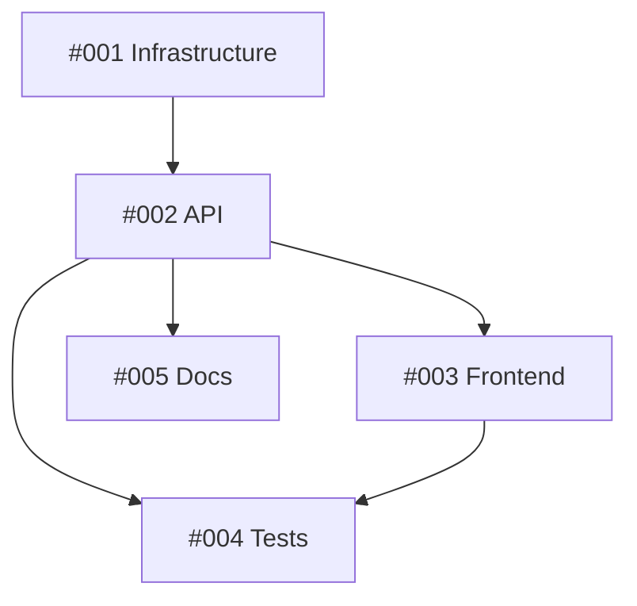

# [EPIC/FEATURE] Main Feature Title

## 📋 Summary
Brief description of what this epic/feature addresses.

## 🎯 Problem Statement
What problem are we trying to solve? Why is this important?

## 💡 Proposed Solution
High-level description of the proposed feature or fix.

## 🔧 Task Breakdown & Assignments

### Sub-Issues Overview
| Issue | Title                              | Agent/Assignee          | Story Points | Priority | Dependencies | Completed |
| ----- | ---------------------------------- | ----------------------- | ------------ | -------- | ------------ | --------- |
| #001  | [Component A] Setup Infrastructure | @cloud-architect        | 5            | High     | None         | [ ]       |
| #002  | [Component B] API Implementation   | @backend-architect      | 8            | High     | #001         | [ ]       |
| #003  | [Component C] Frontend Integration | @frontend-developer     | 5            | Medium   | #002         | [ ]       |
| #004  | [Testing] Unit Tests               | @test-automator         | 3            | Medium   | #002, #003   | [ ]       |
| #005  | [Docs] API Documentation           | @api-documenter         | 2            | Low      | #002         | [ ]       |

> **📝 Status Update Instructions:**
> When a sub-issue is completed, edit this issue description and check the corresponding box `[x]` in the "Completed" column above.
> **DO NOT** post status updates in comments. Keep all progress tracking in this single table for a single source of truth.

**Total Story Points**: 23

### Agent Assignments & Specializations
| Agent              | Specialization          | Assigned Tasks | Total Points |
| ------------------ | ----------------------- | -------------- | ------------ |
| @cloud-architect   | Infrastructure & DevOps | #001           | 5            |
| @backend-architect | API & Backend Systems   | #002           | 8            |
| @frontend-developer| UI/UX & Client-side     | #003           | 5            |
| @test-automator    | Quality & Testing       | #004           | 3            |
| @api-documenter    | Documentation           | #005           | 2            |

### Dependency Graph

### Integration Points
- **#001 (@cloud-architect) → #002 (@backend-architect)**: Infrastructure endpoints and connection configs
- **#002 (@backend-architect) → #003 (@frontend-developer)**: REST API contract and response formats
- **#002 & #003 → #004 (@test-automator)**: Integration test scenarios and E2E flows
- **#002 (@backend-architect) → #005 (@api-documenter)**: API specification and usage examples

## ✅ Acceptance Criteria

- [ ] All sub-issues are completed and merged
- [ ] Integration tests pass across all components
- [ ] Documentation is complete and reviewed
- [ ] Code review completed
- [ ] No breaking changes to existing functionality
- [ ] Performance benchmarks meet requirements

## 📎 Additional Context

### Related Issues
- #[related_issue_number] - [Description]

### References
- [Design doc](link)
- [API spec](link)
- [Prototype](link)

### Screenshots/Mockups
_Add visual references if applicable_

## 🏷️ Labels
`epic`, `feature`, `needs-breakdown`

## 📅 Timeline
- **Start**: [Date]
- **Target Completion**: [Date]
- **Estimated Duration**: [X story points]

## 👥 Team
- **Owner**: @username
- **Contributors**: @user1, @user2, @user3
- **Reviewers**: @reviewer1, @reviewer2
