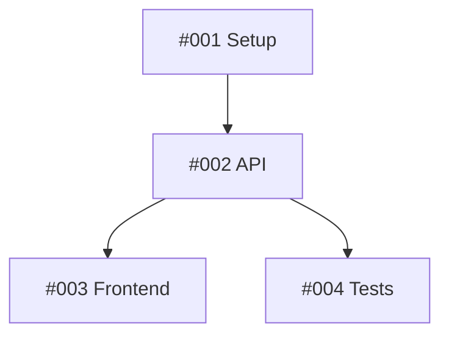

# GitHub Templates Reference

Comprehensive GitHub issue and pull request templates used by Claude Code slash commands.

## Table of Contents

- [Overview](#overview)
- [Templates](#templates)
  - [GH_PARENT_ISSUE_TEMPLATE.md](#gh_parent_issue_templatemd)
  - [GH_SUB_ISSUE_TEMPLATE.md](#gh_sub_issue_templatemd)
  - [GH_PR_TEMPLATE.md](#gh_pr_templatemd)
  - [GH_USER_STORY_TEMPLATE.md](#gh_user_story_templatemd)
- [Usage](#usage)
- [Best Practices](#best-practices)

---

## Overview

These templates provide standardized structures for GitHub issues and pull requests, ensuring consistency, completeness, and effective collaboration across projects.

**Key Features:**
- Story point estimation using Fibonacci sequence
- Agent/team assignment tracking
- Dependency mapping and integration points
- Progress tracking with single-source-of-truth
- BDD/Gherkin syntax for user stories
- Semantic versioning enforcement
- Comprehensive acceptance criteria

**Used By Commands:**
- `/issue` - Parent and sub-issue creation
- `/pr` - Pull request generation
- `/user-story` - BDD user story creation

---

## Templates

### GH_PARENT_ISSUE_TEMPLATE.md

**Purpose:** Parent issue/epic template with task breakdown and sub-issue tracking.

**File:** `~/.claude/templates/GH_PARENT_ISSUE_TEMPLATE.md`

**Used By:** `/issue` command

**Structure:**

```markdown
# [EPIC/FEATURE] Main Feature Title

## 📋 Summary
Brief description of the epic/feature

## 🎯 Problem Statement
What problem are we solving and why?

## 💡 Proposed Solution
High-level description of the approach

## 🔧 Task Breakdown & Assignments
Sub-issues table with progress tracking

## ✅ Acceptance Criteria
Overall completion criteria

## 📎 Additional Context
Related issues, references, screenshots
```

**Key Features:**

1. **Sub-Issues Overview Table**
   ```markdown
   | Issue | Title | Agent/Assignee | Story Points | Priority | Dependencies | Completed |
   | ----- | ----- | -------------- | ------------ | -------- | ------------ | --------- |
   | #001  | ...   | @agent-name    | 5            | High     | None         | [ ]       |
   ```
   - Progress tracked via checkboxes `[x]` in "Completed" column
   - Single source of truth (no comment updates)

2. **Agent Assignments & Specializations**
   - Maps agents to their expertise areas
   - Total story points per agent
   - Skills/tooling requirements

3. **Claude Code Skills & Tooling**
   - Lists existing applicable skills from `~/.claude/skills/`
   - Recommends new custom skills for domain-specific work

4. **Dependency Graph**
   - Mermaid diagram showing task dependencies
   - Visual representation of workflow

5. **Integration Points**
   - Defines handoffs between agents/teams
   - Specifies interfaces and data formats

**Story Points:**
- Uses Fibonacci sequence: 1, 2, 3, 5, 8, 13, 21
- Represents complexity and effort, not time
- Totaled for estimation purposes

**Example Usage:**
```bash
/issue Implement payment processing with Stripe integration
```

**Output:** Creates parent issue with sub-task table, dependency graph, and agent assignments.

---

### GH_SUB_ISSUE_TEMPLATE.md

**Purpose:** Detailed sub-issue/task template for individual components.

**File:** `~/.claude/templates/GH_SUB_ISSUE_TEMPLATE.md`

**Used By:** `/issue` command (automatically for sub-tasks)

**Structure:**

```markdown
# [SUB-ISSUE] Component/Module Name

## 🔗 Parent Issue
Links to parent epic

## 👤 Assignment
Agent/team member with specialization

## 🛠️ Skills & Tooling
Claude Code skills and custom skill needs

## 📋 Summary & Scope
What's included and excluded

## 🔧 Technical Details
Implementation approach and interfaces

## ✅ Acceptance Criteria
Specific completion requirements

## 🧪 Testing Strategy
Unit and integration test requirements

## 🤝 Handoff Checklist
Requirements for dependent teams/agents
```

**Key Features:**

1. **Assignment Section**
   - Assigned agent/team member
   - Specialization (e.g., backend-architect, frontend-developer)
   - Story points using Fibonacci

2. **Skills & Tooling**
   - Claude Code skills from `~/.claude/skills/`
   - Custom skill requirements
   - Usage type: Standalone, With Agent, or Both

3. **Scope Definition**
   - In Scope: Specific functionality
   - Out of Scope: What's handled elsewhere

4. **Interface Definition**
   ```yaml
   inputs:
     - parameter1: type, description
   outputs:
     - result1: type, description
   ```

5. **Integration Points**
   - Receives from: upstream components
   - Provides to: downstream components

6. **Handoff Checklist**
   - Interface contract documentation
   - API/method documentation
   - Data models/schemas
   - Error handling patterns
   - Integration validation

**Example Usage:**
Generated automatically by `/issue` command for each sub-task.

---

### GH_PR_TEMPLATE.md

**Purpose:** Comprehensive pull request template with change classification.

**File:** `~/.claude/templates/GH_PR_TEMPLATE.md`

**Used By:** `/pr` command

**Structure:**

```markdown
## Summary
Concise description of changes

## Motivation & Context
Why this change is needed

## Type of Change
Change classification checklist

## Changes Made
What's New/Changed/Fixed/Removed

## Technical Details
Architecture, database, API, config changes

## Testing
Test coverage and evidence

## Deployment Notes
Steps and considerations

## Breaking Changes
Impact and migration guide

## Performance Impact
Metrics and benchmarks

## Security Considerations
Vulnerability analysis

## Documentation
Updated documentation references

## Checklist
Pre-merge verification
```

**Change Types:**
- 🐛 Bug fix
- ✨ New feature
- 💥 Breaking change
- 📝 Documentation
- 🎨 Style
- ♻️ Refactor
- ⚡ Performance
- ✅ Test
- 🔧 Build
- 🚀 CI/CD
- 🔨 Chore
- ⏪ Revert

**Key Features:**

1. **Type Classification**
   - Single checkbox per PR type
   - Helps reviewers understand intent

2. **Technical Details Breakdown**
   - Architecture changes
   - Database migrations
   - API modifications
   - Configuration changes

3. **Test Evidence**
   - Unit/integration/E2E coverage
   - Test output and coverage reports
   - Manual testing documentation

4. **Breaking Changes**
   - Impact analysis
   - Migration guide
   - Backward compatibility notes

5. **Performance Impact**
   - Before/after metrics
   - Benchmarks and profiling
   - Resource usage

**Example Usage:**
```bash
/pr feat(auth): implement OAuth2 with Google and GitHub providers
```

**Output:** Complete PR with repository analysis, change classification, and comprehensive documentation.

---

### GH_USER_STORY_TEMPLATE.md

**Purpose:** BDD user story template with Gherkin syntax and semantic versioning.

**File:** `~/.claude/templates/GH_USER_STORY_TEMPLATE.md`

**Used By:** `/user-story` command

**Structure:**

```markdown
# User Story: [Feature Name]

## Story Overview
As a/I want/So that format

## Version Information
Semantic version with change type

## Acceptance Criteria
Gherkin scenarios (Given/When/Then)

## Business Context
Problem, impact, value

## Technical Context
Dependencies, integrations, data requirements

## Design & UX
UI/UX considerations and accessibility

## Testing Strategy
Test scenarios and performance criteria

## Definition of Done
Completion checklist

## Additional Context
Related stories and references
```

**Key Features:**

1. **Story Format**
   ```
   As a [persona]
   I want [goal]
   So that [benefit]
   ```

2. **Version Information**
   - Semantic version (X.Y.Z format)
   - Change type classification
   - Version badge: `[]()`
   - Version impact explanation

3. **Semantic Versioning**
   - **Major (X.0.0)**: Breaking changes
   - **Minor (0.X.0)**: New features (backward compatible)
   - **Patch (0.0.X)**: Bug fixes

4. **Gherkin Scenarios**
   ```gherkin
   Feature: [Feature name]

     Scenario: [Scenario name]
       Given [precondition]
       And [additional context]
       When [action]
       And [additional action]
       Then [expected outcome]
       And [additional verification]
   ```

5. **Multiple Scenario Types**
   - Primary happy path
   - Alternative paths
   - Error/edge cases
   - E2E test scenarios

6. **Business Context**
   - Priority (High/Medium/Low)
   - User segment
   - Expected usage frequency
   - Quantified business value

7. **Accessibility Requirements**
   - Keyboard navigation
   - Screen reader support
   - WCAG 2.1 compliance level

8. **Performance Criteria**
   - Response time targets
   - Throughput requirements
   - Data volume handling

9. **Definition of Done**
   - Comprehensive checklist
   - Code review
   - Test coverage (>80%)
   - Documentation
   - Security review
   - Product owner acceptance

**Example Usage:**
```bash
/user-story Create admin dashboard with real-time analytics
```

**Output:** Complete BDD user story with Gherkin scenarios, version info, and GitHub Projects integration.

---

## Usage

### Template Location

All templates are stored in `~/.claude/templates/`:
```
~/.claude/templates/
├── GH_PARENT_ISSUE_TEMPLATE.md
├── GH_SUB_ISSUE_TEMPLATE.md
├── GH_PR_TEMPLATE.md
└── GH_USER_STORY_TEMPLATE.md
```

### Loading Templates

Commands automatically load their required templates:

**Issue Creation:**
```bash
/issue Implement user authentication
# Loads: GH_PARENT_ISSUE_TEMPLATE.md + GH_SUB_ISSUE_TEMPLATE.md
```

**PR Creation:**
```bash
/pr Add OAuth2 authentication
# Loads: GH_PR_TEMPLATE.md
```

**User Story Creation:**
```bash
/user-story Admin analytics dashboard
# Loads: GH_USER_STORY_TEMPLATE.md
```

### Customization

Templates can be customized for specific project needs:

1. Copy template to project `.github/` directory
2. Modify sections as needed
3. Commands will detect and use project-specific templates first

**Example:**
```bash
# Project-specific PR template
.github/pull_request_template.md

# Command automatically uses project template
/pr Add new feature
```

---

## Best Practices

### Story Points

**Use Fibonacci Sequence:**
- 1: Trivial task (minutes)
- 2: Simple task (< 1 hour)
- 3: Moderate task (few hours)
- 5: Complex task (half day)
- 8: Very complex (full day)
- 13: Epic task (multiple days)
- 21: Major epic (week+)

**Never Use Time-Based Estimates:**
- ❌ "2 hours", "3 days"
- ✅ "5 story points"

### Progress Tracking

**Update Parent Issue Description:**
```markdown
| Issue | Title | Assignee | Points | Priority | Dependencies | Completed |
| ----- | ----- | -------- | ------ | -------- | ------------ | --------- |
| #001  | Setup | @dev1    | 5      | High     | None         | [x]       |
| #002  | API   | @dev2    | 8      | High     | #001         | [ ]       |
```

**Don't Use Comments:**
- Comments are for discussion
- Description is single source of truth
- Check boxes `[x]` show progress

### Dependencies

**Map Dependencies Clearly:**
```markdown
Dependencies:
- Blocks: #123, #124
- Blocked by: #100, #101
- External: Stripe API v2, AWS S3
```

**Create Dependency Graphs:**


### Integration Points

**Define Clear Interfaces:**
```markdown
Integration Points:
- #001 → #002: REST API endpoints, JSON response format
- #002 → #003: GraphQL schema, WebSocket events
- #002 & #003 → #004: E2E test scenarios, mock data
```

### Gherkin Syntax

**Follow Best Practices:**

✅ **Good:**
```gherkin
Given I am logged in as an administrator
When I navigate to the settings page
Then I should see the "User Management" section
```

❌ **Bad:**
```gherkin
Given admin logged in
When go to settings
Then see user stuff
```

**Use Proper Keywords:**
- `Given`: Preconditions/context
- `When`: Actions/events
- `Then`: Expected outcomes
- `And`: Additional steps
- `But`: Negative assertions

### Semantic Versioning

**Choose Version Bumps Correctly:**

**Major (Breaking):**
```
v1.5.2 → v2.0.0
- Removed deprecated API endpoints
- Changed authentication method
- Restructured database schema
```

**Minor (Feature):**
```
v1.5.2 → v1.6.0
- Added new dashboard widgets
- Introduced export to PDF feature
- Enhanced search with filters
```

**Patch (Fix):**
```
v1.5.2 → v1.5.3
- Fixed login redirect bug
- Corrected typo in error message
- Resolved memory leak
```

### Claude Code Skills

**Map Skills to Tasks:**
```markdown
Existing Skills to Use:
- `webgl-expert` for 3D visualization (#003)
- `argus-deployment` for CZI platform setup (#001)
- `secure-web-search` for research phase (#000)

Recommended New Skills:
- Create "financial-risk-modeling" skill for derivatives pricing (#002)
- Create "fda-compliance-check" skill for medical device validation (#004)
```

### Accessibility

**Always Include:**
- Keyboard navigation requirements
- Screen reader compatibility
- WCAG compliance level (A/AA/AAA)
- Color contrast requirements
- Focus management

### Testing Strategy

**Cover All Levels:**
1. **Unit Tests**: Individual functions/methods
2. **Integration Tests**: Component interactions
3. **E2E Tests**: Complete user workflows
4. **Performance Tests**: Load and stress testing
5. **Security Tests**: Vulnerability scanning

### Documentation

**Update Concurrently:**
- API documentation
- README files
- Architecture diagrams
- Deployment guides
- User manuals

---

## Related Documentation

- **Commands:** `~/.claude/commands/README.md`
- **Skills:** `~/.claude/skills/README.md`
- **Agents:** `~/.claude/agents/README.md`
- **GitHub CLI:** `gh help`
